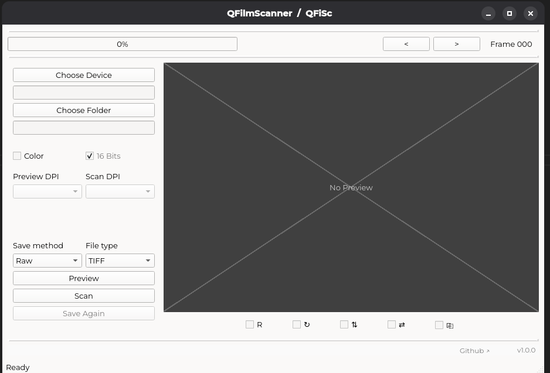
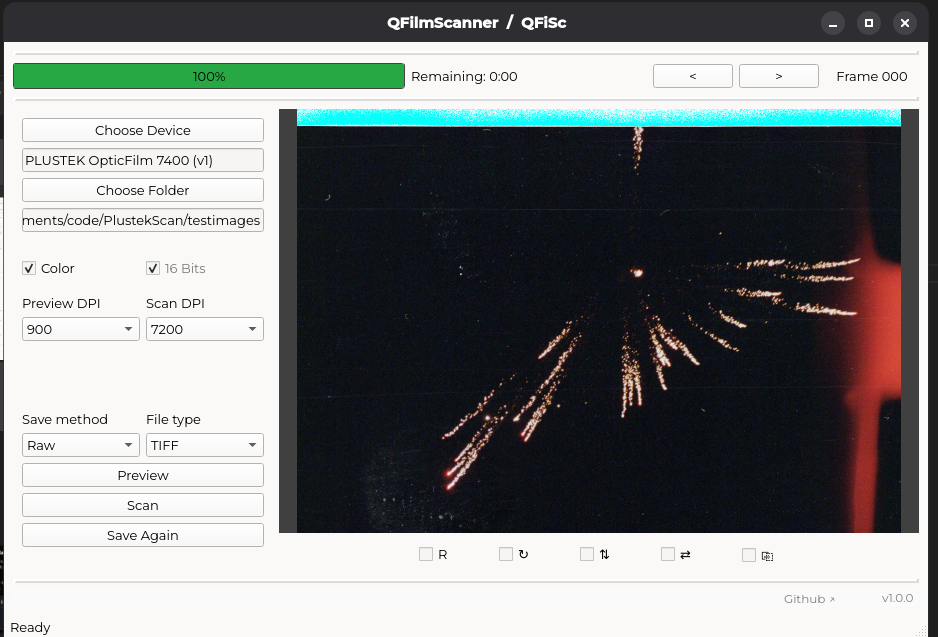

# QFilmScanner
QFiSc - QT Film Scanner supporting **Plustek** and possibly other **SANE-supported flatbed devices**, on Linux!

## Screenshots

**Default view / Scan done:**  

    
    

---

# Usage

Examples added here.

## Features

- Scan previews and final frames  
- Frame-by-frame scanning with automatic numbering  
- Support for **color / black & white**, **16-bit depth**, and basic image transforms (negate, rotate90, mirror horizontally, mirror vertically, auto-level 0.05/99.5%)  
- Save scans in multiple formats (`JPEG`, `PNG`, `TIFF`, `WEBP`, `BMP`) and save methods (`Raw`, `Edited`, `Raw + Edited`)  
- Embedded UI font for consistent look (Montserrat)  
- Status bar

# Tested devices

Tested devices list can be found from [here](docs/SUPPORTED.md).  
The build started for Plustek OpticFilm 7400, but supports any SANE-supported devices, found [here](http://www.sane-project.org/sane-mfgs.html#Z-PLUSTEK).

- - -
Made with QT6. Made with SANE-backend. Made with love, luck and freedom.